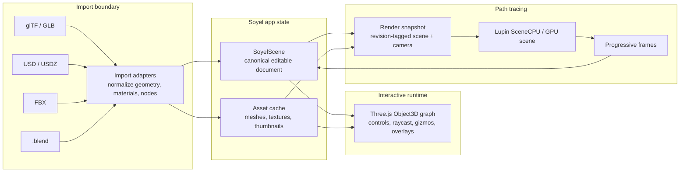

# Soyel scene model architecture

## Summary

Soyel should use a small, explicit, serializable scene model as its canonical
application state. Three.js should remain the interactive runtime scene graph for
selection, camera controls, outlines, and transform gizmos. Lupin should receive
renderer snapshots converted from the same canonical scene state.

This avoids making any imported file format, frontend engine object, or Lupin
upload structure the app's source of truth. It also gives Soyel a stable place
to represent edits such as material assignment, object transform changes,
visibility, selection, and future object hierarchy.

The current Cornell box is already close to this direction, but it is split
across three hard-coded representations:

- `ViewportScene` names objects and stores camera, selection, and placeholder
  transforms.
- `InteractiveViewport.svelte` creates Three proxy geometry and hard-coded
  Cornell poses from symbolic `meshId`s.
- `src-tauri/src/lib.rs` builds a separate Lupin `SceneCPU` with hard-coded
  quads and boxes.

The next architecture step is to make those projections derived from one Soyel
scene document.

## Recommended model

Soyel should own a canonical scene document with stable IDs and normalized
renderable asset references. The document should be compact enough to send over
Tauri IPC and explicit enough for deterministic conversion to both Three and
Lupin.

```ts
type SoyelScene = {
  schemaVersion: 1;
  revision: number;
  units: "meter";
  cameras: Record<string, SceneCamera>;
  activeCameraId: string;
  nodes: Record<string, SceneNode>;
  meshes: Record<string, MeshAsset>;
  materials: Record<string, MaterialAsset>;
  selection: string | null;
};

type SceneNode = {
  id: string;
  name: string;
  parentId: string | null;
  meshId: string | null;
  materialBindings: Record<string, string>;
  transform: Transform;
  visible: boolean;
  selectable: boolean;
};

type MeshAsset = {
  id: string;
  source: AssetSource;
  bounds?: Bounds;
};

type MaterialAsset = {
  id: string;
  name: string;
  model: "gltf-pbr";
  baseColor: [number, number, number, number];
  roughness: number;
  metallic: number;
  textureRefs: Record<string, TextureRef>;
};
```

Keep the model intentionally narrower than USD or Blender. It should represent
what Soyel can edit and render reliably, not every possible source-format
feature.

## System shape



Three should be treated as a projection of `SoyelScene`, not the canonical
store. The projection can keep live `Object3D` instances, cached geometries,
materials, transform controls, raycasters, and editor helpers. User edits should
flow back into `SoyelScene` first; the Three graph and Lupin renderer should
then update from that state.

Lupin should also be a projection. The backend should receive a revision-tagged
render snapshot, resolve mesh/material assets, build `SceneCPU`, and stream
frames tagged with the same revision. The frontend should drop frames for stale
revisions.

## File formats

Use importers and exporters at the boundary rather than choosing a source file
format as the runtime model.

- glTF/GLB should be the first production import path. It maps well to runtime
  meshes, node transforms, cameras, lights, and PBR material data, and Three can
  preview it directly while Soyel normalizes it into `SoyelScene`.
- USD/USDZ should be treated as the long-term interchange direction for richer
  scene composition, references, variants, and DCC workflows. It should not
  block the first editable scene model.
- FBX and `.blend` should be imported through conversion. Headless Blender is
  the most practical `.blend` bridge; FBX can be handled by Blender, Assimp, or
  a dedicated importer if needed.
- Soyel project save files should store `SoyelScene` plus asset references or a
  packaged asset cache. They should not be raw GLB, USDZ, or Three serialized
  objects.

## Editing behavior

Every user-visible edit should be expressed as a scene-state mutation:

- Camera movement updates `cameras[activeCameraId]`.
- Selection updates `selection`.
- Object movement updates a node `transform`.
- Material assignment updates a node `materialBindings` entry.
- Visibility toggles update `visible`.

Each mutation increments `revision`. The raster viewport updates immediately.
The path tracer restarts or continues only for the newest revision.

Material editing should use glTF-PBR-compatible fields first because the
existing Lupin material path already maps toward `MaterialType::GltfPbr`.
Renderer-specific fields can be added later under an extension object rather
than mixed into the core material shape.

## Current Cornell migration

The Cornell box should become the first scene document fixture:

1. Define mesh assets for the floor, ceiling, walls, light panel, short block,
   and tall block.
2. Move the current hard-coded Cornell poses out of
   `InteractiveViewport.svelte` and into scene node transforms.
3. Make Three build the raster viewport from `SoyelScene.nodes` and
   `SoyelScene.meshes`.
4. Add a backend conversion layer that builds Lupin `SceneCPU` from the same
   scene snapshot.
5. Remove the duplicated hard-coded Cornell geometry from
   `build_soyel_preview_scene` once parity is verified.

The first fixture can still use procedural mesh primitives. It does not need to
come from GLB. The important change is that both renderers consume the same
scene document.

## Implementation plan

### Phase 1: Introduce the canonical scene package

- Replace `ViewportScene` with `SoyelScene` types in `src/lib/viewport-scene.ts`
  while keeping compatibility helpers for the current UI.
- Add a `createDefaultCornellScene()` fixture that contains real node
  transforms, material IDs, and mesh IDs.
- Keep procedural mesh assets for the Cornell primitives so no importer is
  required yet.
- Update selection, material assignment, and camera changes to mutate
  `SoyelScene` and increment `revision`.

### Phase 2: Make Three a scene projection

- Update `InteractiveViewport.svelte` to iterate scene nodes instead of using
  hard-coded Cornell pose switches.
- Build or reuse Three geometry from `MeshAsset` definitions.
- Apply node transforms directly to `Object3D` groups.
- Keep outlines, hover, raycasting, and future transform gizmos in Three only.

### Phase 3: Send render snapshots to Rust

- Extend `RenderPreviewRequest` and `streamPreviewFrame` to include the active
  camera, visible nodes, mesh references, material assignments, and scene
  revision.
- Define matching Rust `Deserialize` structs for the snapshot.
- Convert snapshot nodes and procedural mesh assets into Lupin `SceneCPU`.
- Keep frame revision checks unchanged so stale path-traced frames are ignored.

### Phase 4: Replace duplicated Cornell backend geometry

- Build Lupin Cornell geometry only through the generic snapshot converter.
- Add a regression test that the default Soyel scene renders nonzero pixels.
- Add a geometry-count or surface-ID test so all Cornell nodes are represented
  in both Three and Lupin projections.
- Remove the old `build_soyel_preview_scene` hard-coded Cornell construction
  after parity is confirmed.

### Phase 5: Add import paths

- Start with GLB/glTF import in the frontend or backend, normalize the loaded
  node hierarchy, meshes, and PBR materials into `SoyelScene`.
- Persist imported asset payloads in an asset cache keyed by stable IDs.
- Add `.blend`, FBX, and USD/USDZ through conversion adapters only after the
  normalized scene model and GLB path are stable.

### Phase 6: Add project persistence

- Save `SoyelScene` as the project document.
- Store large binary assets separately in a project asset directory or packaged
  archive.
- Version the schema and write migrations before changing persisted fields.
